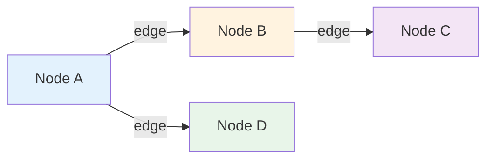
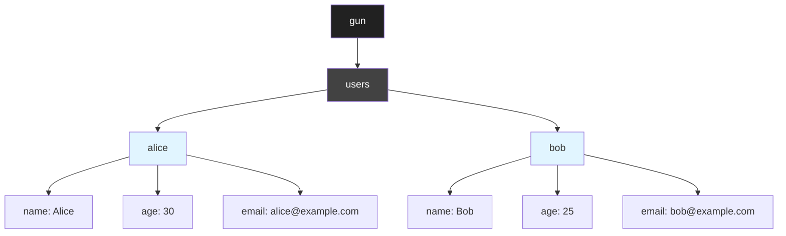
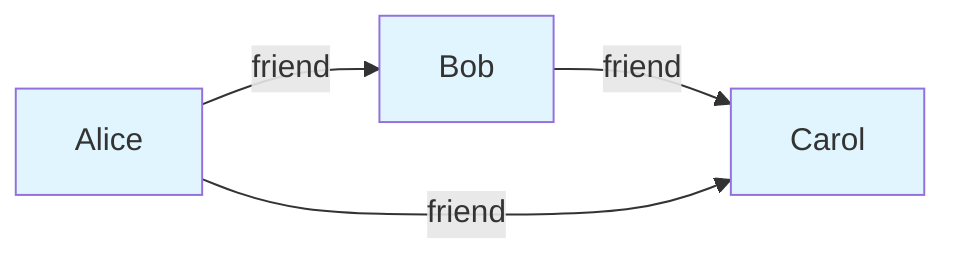
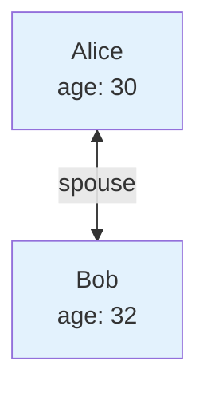
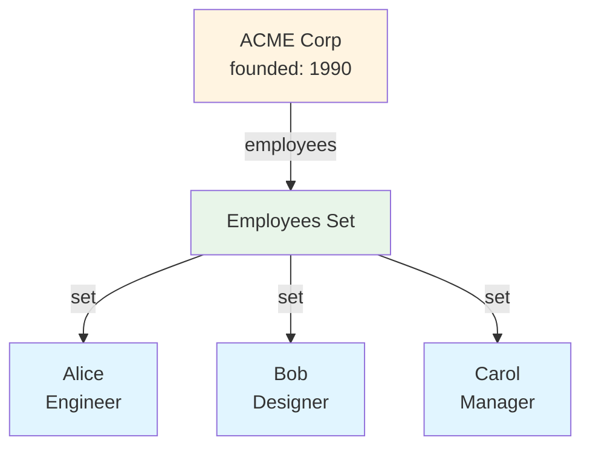
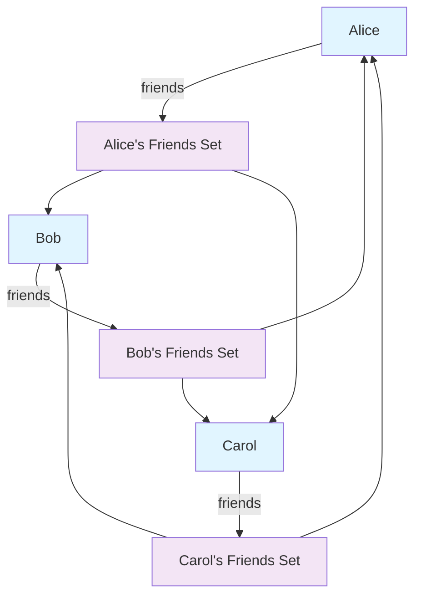
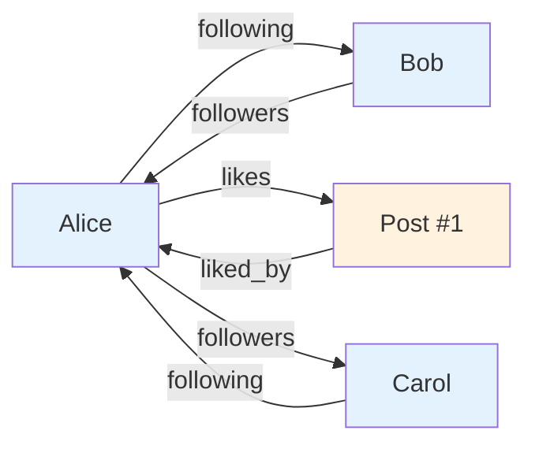
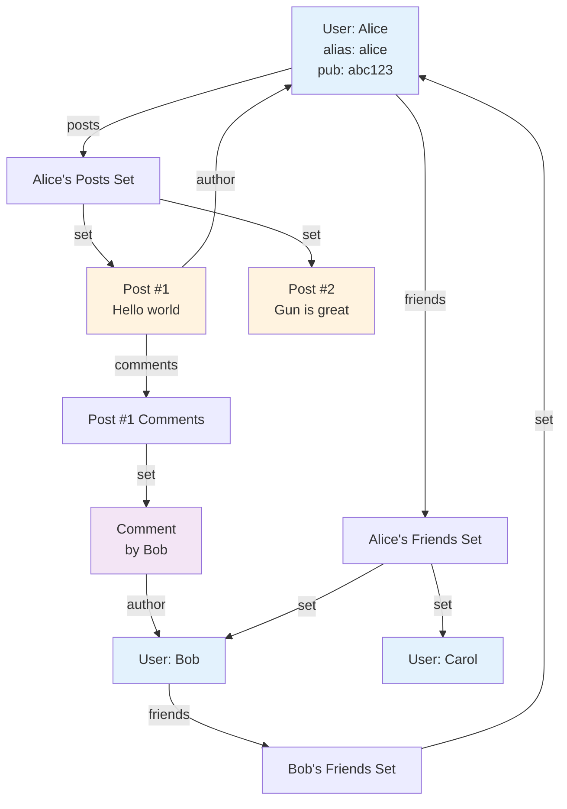
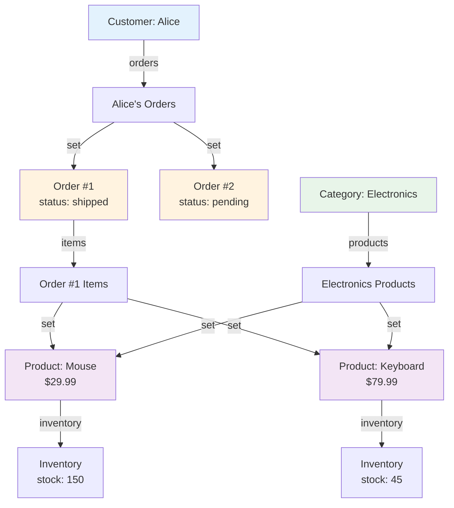
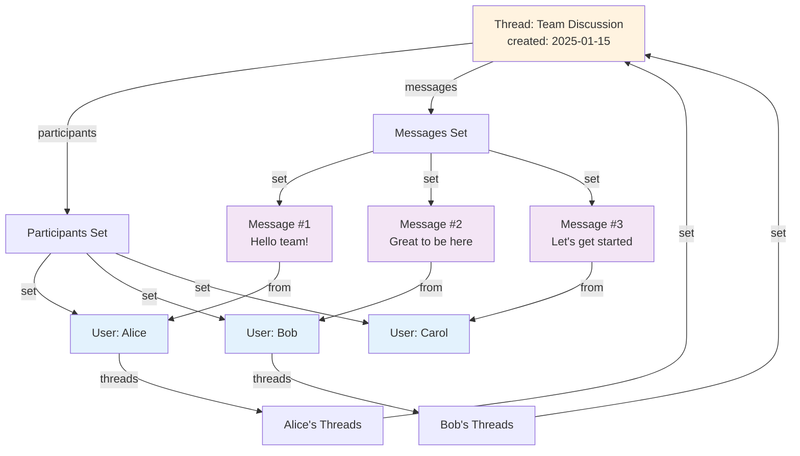

# Gun.js Graph Database Guide

> **Comprehensive guide to modeling data in Gun's graph database**
>
> Part of @ariob/core - Learn how to structure your decentralized, real-time data.

---

## Table of Contents

- [Introduction](#introduction)
- [Understanding Graphs](#understanding-graphs)
- [Graph Patterns](#graph-patterns)
  - [Key/Value Storage](#keyvalue-storage)
  - [Document Hierarchies](#document-hierarchies)
  - [Graph Relationships](#graph-relationships)
- [Relationship Types](#relationship-types)
  - [One-to-One (1-1)](#one-to-one-1-1)
  - [One-to-Many (1-N)](#one-to-many-1-n)
  - [Many-to-Many (N-N)](#many-to-many-n-n)
  - [Bi-directional Links](#bi-directional-links)
- [Real-World Examples](#real-world-examples)
  - [Social Network](#social-network)
  - [E-Commerce Platform](#e-commerce-platform)
  - [Messaging Application](#messaging-application)
- [Best Practices](#best-practices)
- [Anti-Patterns to Avoid](#anti-patterns-to-avoid)
- [Performance Optimization](#performance-optimization)

---

## Introduction

Gun is a **graph database** that treats all data as interconnected nodes in a graph. Unlike traditional relational databases with tables and rows, or document databases with collections and documents, Gun uses a flexible graph model that can represent:

- **Key/Value pairs** - Simple data storage
- **Documents** - Nested object hierarchies
- **Graphs** - Complex relationships between entities

This flexibility makes Gun ideal for decentralized, real-time applications where data relationships are dynamic and need to sync across peers.

---

## Understanding Graphs

A **graph** consists of **nodes** (entities) and **edges** (relationships). In Gun:

- **Nodes** are JavaScript objects with properties
- **Edges** are references between nodes
- **Paths** are chains of references to traverse the graph



---

## Graph Patterns

### Key/Value Storage

The simplest pattern: store and retrieve values by key using `node()`.

```typescript
import { node, graph, z } from '@ariob/core';

// Define schema
const UserSchema = z.object({
  name: z.string(),
  age: z.number(),
  email: z.string().email(),
});

// Create node
const alice = node('users/alice', { schema: UserSchema });

// Write with type-safety
const g = graph();
const userRef = g.get('users').get('alice');
alice.on(userRef, UserSchema);
alice.set({ name: 'Alice', age: 30, email: 'alice@example.com' });

// Read (type-safe)
const userData = alice.get(); // { name: string, age: number, email: string } | null
```

**Mermaid Diagram: Key/Value Structure**



**When to use:**
- Simple data lookups
- User profiles
- Configuration settings
- Atomic values that don't need relationships

---

### Document Hierarchies

Store nested objects as hierarchical structures.

```javascript
// Write nested document
gun.get('company').get('acme').put({
  name: 'ACME Corp',
  founded: 1990,
  address: {
    street: '123 Main St',
    city: 'San Francisco',
    zip: '94102'
  }
});

// Read nested path
gun.get('company').get('acme').get('address').get('city').once((city) => {
  console.log(city); // 'San Francisco'
});
```

**Important:** Gun only returns one level deep by default. Deep nesting returns references, not full data.

```javascript
// This returns links, not full data
gun.get('company').get('acme').once((data) => {
  console.log(data);
  // { name: 'ACME Corp', founded: 1990, address: { '#': 'ref/to/address' } }
});

// Need to traverse explicitly for nested data
gun.get('company').get('acme').get('address').once((address) => {
  console.log(address);
  // { street: '123 Main St', city: 'San Francisco', zip: '94102' }
});
```

**When to use:**
- Structured data with clear hierarchy
- Company/organization data
- Product details
- Configuration with nested sections

---

### Graph Relationships

Connect nodes to model complex relationships.

```javascript
// Create nodes
const alice = gun.get('users').get('alice');
const bob = gun.get('users').get('bob');

// Create relationship
alice.get('friend').put(bob);

// Traverse relationship
alice.get('friend').once((friendData) => {
  console.log(friendData); // Bob's data
});
```

**Mermaid Diagram: Simple Graph Relationship**



**When to use:**
- Social connections
- Organizational hierarchies
- Content relationships (posts, comments)
- Any interconnected data

---

## Relationship Types

### One-to-One (1-1)

One entity relates to exactly one other entity.

**Example: Spouse Relationship**

```javascript
const alice = gun.get('users').get('alice');
const bob = gun.get('users').get('bob');

// Create bi-directional 1-1 relationship
alice.get('spouse').put(bob);
bob.get('spouse').put(alice);

// Query
alice.get('spouse').once((spouse) => {
  console.log('Alice is married to:', spouse.name);
});
```

**Mermaid Diagram: One-to-One Relationship**



**Real-world examples:**
- User ↔ User Profile
- Employee ↔ Manager (direct report)
- Post ↔ Featured Image

---

### One-to-Many (1-N)

One entity relates to many entities. Use `collection()` to manage sets.

**Example: Company Employees**

```typescript
import { node, collection, graph, z } from '@ariob/core';

// Company schema
const CompanySchema = z.object({
  name: z.string(),
  founded: z.number(),
});

// Employee schema
const EmployeeSchema = z.object({
  name: z.string(),
  role: z.string(),
  email: z.string().email(),
});

const g = graph();

// Create company node
const company = node('companies/acme', { schema: CompanySchema });
const companyRef = g.get('companies').get('acme');
company.on(companyRef, CompanySchema);
company.set({ name: 'ACME Corp', founded: 1990 });

// Create employees collection
const employees = collection('companies/acme/employees');
const employeesRef = g.get('companies').get('acme').get('employees');

// Subscribe to collection
employees.map(employeesRef, EmployeeSchema);

// Add employees (type-safe)
await employees.set(employeesRef, {
  name: 'Alice',
  role: 'Engineer',
  email: 'alice@acme.com'
}, EmployeeSchema);

await employees.set(employeesRef, {
  name: 'Bob',
  role: 'Designer',
  email: 'bob@acme.com'
}, EmployeeSchema);

// Query all employees
const allEmployees = employees.get(); // Item<Employee>[]
allEmployees.forEach(({ id, data }) => {
  console.log('Employee:', data.name, '-', data.role);
});
```

**Important:** Use `collection()` for sets, not `node()` for multiple items!

**Mermaid Diagram: One-to-Many Relationship**



**Real-world examples:**
- User → Posts
- Category → Products
- Playlist → Songs
- Channel → Messages

---

### Many-to-Many (N-N)

Many entities relate to many other entities. Each entity maintains its own set of relationships.

**Example: Friend Network**

```javascript
const alice = gun.get('users').get('alice');
const bob = gun.get('users').get('bob');
const carol = gun.get('users').get('carol');

// Alice's friends
alice.get('friends').set(bob);
alice.get('friends').set(carol);

// Bob's friends
bob.get('friends').set(alice);
bob.get('friends').set(carol);

// Carol's friends
carol.get('friends').set(alice);
carol.get('friends').set(bob);

// Query Alice's friends
alice.get('friends').map().once((friend) => {
  console.log('Alice is friends with:', friend.name);
});
```

**Mermaid Diagram: Many-to-Many Relationship**



**Real-world examples:**
- Users ↔ Groups
- Posts ↔ Tags
- Products ↔ Categories
- Students ↔ Courses

---

### Bi-directional Links

For efficient traversal, store relationships in both directions.

**Example: Follow Relationship**

```javascript
// Alice follows Bob
gun.get('users').get('alice').get('following').set(
  gun.get('users').get('bob')
);

// Bob gets a follower (reverse relationship)
gun.get('users').get('bob').get('followers').set(
  gun.get('users').get('alice')
);

// Query: Who does Alice follow?
gun.get('users').get('alice').get('following').map().once((user) => {
  console.log('Alice follows:', user.name);
});

// Query: Who follows Bob?
gun.get('users').get('bob').get('followers').map().once((user) => {
  console.log(user.name, 'follows Bob');
});
```

**Mermaid Diagram: Bi-directional Relationships**



**Benefits:**
- Fast queries in both directions
- No need to traverse entire graph
- Better performance for large datasets

**Trade-off:** Must maintain both relationships when updating.

---

## Real-World Examples

### Social Network

A complete social network graph structure using @ariob/core.

**Data Model:**

```typescript
import { node, collection, graph, z } from '@ariob/core';

// Define schemas
const UserSchema = z.object({
  alias: z.string(),
  pub: z.string(),
  bio: z.string().optional(),
  created: z.number(),
});

const PostSchema = z.object({
  id: z.string(),
  content: z.string(),
  author: z.string(), // pub key
  created: z.number(),
});

const CommentSchema = z.object({
  id: z.string(),
  text: z.string(),
  author: z.string(),
  postId: z.string(),
  created: z.number(),
});

const g = graph();

// Create user node
const alice = node(`users/${userPub}`, { schema: UserSchema });
const aliceRef = g.get('users').get(userPub);
alice.on(aliceRef, UserSchema);
alice.set({
  alias: 'alice',
  pub: userPub,
  bio: 'Software engineer',
  created: Date.now(),
});

// User's posts collection
const alicePosts = collection(`users/${userPub}/posts`);
const alicePostsRef = g.get('users').get(userPub).get('posts');
alicePosts.map(alicePostsRef, PostSchema);

// Add post
const postId = `post-${Date.now()}`;
await alicePosts.set(alicePostsRef, {
  id: postId,
  content: 'Hello, world!',
  author: userPub,
  created: Date.now(),
}, PostSchema);

// User's friends set (using Gun directly for relationships)
g.get('users').get(userPub).get('friends').set(
  g.get('users').get(friendPub)
);

// Post comments collection
const postComments = collection(`posts/${postId}/comments`);
const postCommentsRef = g.get('posts').get(postId).get('comments');
postComments.map(postCommentsRef, CommentSchema);
```

**Mermaid Diagram: Social Network Graph**



**Common Queries:**

```javascript
// Get user's posts
gun.get('users').get(userPub).get('posts').map().on((post) => {
  console.log('Post:', post.content);
});

// Get post comments
gun.get('posts').get(postId).get('comments').map().on((comment) => {
  console.log('Comment:', comment.text);
});

// Get user's friends
gun.get('users').get(userPub).get('friends').map().on((friend) => {
  console.log('Friend:', friend.alias);
});
```

---

### E-Commerce Platform

Product catalog with orders and inventory.

**Data Model:**

```javascript
// Products
gun.get('products').get(productId).put({
  id: productId,
  name: 'Wireless Mouse',
  price: 29.99,
  sku: 'MOUSE-001'
});

// Inventory
gun.get('inventory').get(productId).put({
  productId,
  stock: 150,
  warehouse: 'SF-01'
});

// Orders
gun.get('orders').get(orderId).put({
  id: orderId,
  customer: customerPub,
  status: 'pending',
  total: 59.98,
  created: Date.now()
});

// Order items
gun.get('orders').get(orderId).get('items').set(
  gun.get('products').get(productId)
);

// Customer orders
gun.get('customers').get(customerPub).get('orders').set(
  gun.get('orders').get(orderId)
);
```

**Mermaid Diagram: E-Commerce Graph**



---

### Messaging Application

Threads, messages, and participants.

**Data Model:**

```javascript
// Create thread
gun.get('threads').get(threadId).put({
  id: threadId,
  name: 'Team Discussion',
  created: Date.now()
});

// Add participants
gun.get('threads').get(threadId).get('participants').set(
  gun.get('users').get(userPub)
);

// Send message
const messageId = `msg-${Date.now()}`;
gun.get('messages').get(messageId).put({
  id: messageId,
  threadId,
  from: userPub,
  text: 'Hello team!',
  created: Date.now()
});

// Add message to thread
gun.get('threads').get(threadId).get('messages').set(
  gun.get('messages').get(messageId)
);

// Add thread to user's threads
gun.get('users').get(userPub).get('threads').set(
  gun.get('threads').get(threadId)
);
```

**Mermaid Diagram: Messaging Graph**



---

## Best Practices

### 1. Use `.set()` for Collections

```javascript
// ✅ CORRECT - Maintains a set
user.get('posts').set(post);
user.get('posts').set(anotherPost);

// ❌ WRONG - Overwrites everything
user.get('posts').put(post); // First post lost when second is added
```

### 2. Create Bi-directional Relationships

For efficient querying, store relationships in both directions:

```javascript
// ✅ GOOD - Can query both ways
alice.get('friends').set(bob);
bob.get('friends').set(alice);

// ❌ LIMITED - Can only query from Alice's perspective
alice.get('friends').set(bob);
```

### 3. Use Unique IDs

Generate unique IDs for nodes to avoid conflicts:

```javascript
// ✅ GOOD
const postId = `post-${Date.now()}-${Math.random().toString(36).slice(2)}`;
gun.get('posts').get(postId).put({ content: 'Hello' });

// ❌ RISKY - May have conflicts
gun.get('posts').get('1').put({ content: 'Hello' });
```

### 4. Partial Updates Only

Update only what changes - Gun merges automatically:

```javascript
// ✅ EFFICIENT
user.get('profile').put({ bio: 'New bio' }); // Only updates bio

// ❌ INEFFICIENT
user.get('profile').once((profile) => {
  profile.bio = 'New bio';
  user.get('profile').put(profile); // Re-sends entire object
});
```

### 5. Index by Time or Relevance

For sorted lists, use timestamps as keys:

```javascript
// ✅ SORTABLE
const timestamp = Date.now();
feed.get(timestamp).put({ content: 'Post' });

// Query in order
feed.map().on((item, key) => {
  // Key is timestamp, naturally sorted
});
```

---

## Anti-Patterns to Avoid

### ❌ Deep Nesting

Gun only returns one level deep. Avoid deeply nested structures:

```javascript
// ❌ BAD - Deep nesting
gun.get('app').put({
  users: {
    alice: {
      profile: {
        address: {
          street: '123 Main'
        }
      }
    }
  }
});

// ✅ BETTER - Flat structure with references
gun.get('users').get('alice').get('profile').put({ name: 'Alice' });
gun.get('users').get('alice').get('address').put({ street: '123 Main' });
```

### ❌ Counters with `.put()`

Don't increment counters naively - creates race conditions:

```javascript
// ❌ RACE CONDITION
user.get('count').once((val) => {
  user.get('count').put((val || 0) + 1); // Multiple peers = divergence
});

// ✅ USE SET-BASED COUNTING
user.get('likes').get(Date.now().toString()).put(true);
// Count: user.get('likes').map().once((items) => Object.keys(items).length)
```

### ❌ Deleting Data

Gun doesn't support true deletion (CRDT limitation). Use tombstones:

```javascript
// ❌ DOESN'T WORK
gun.get('posts').get(postId).put(null); // Doesn't delete

// ✅ TOMBSTONE PATTERN
gun.get('posts').get(postId).put({ deleted: true, deletedAt: Date.now() });

// Filter out deleted items
gun.get('posts').map().on((post) => {
  if (!post.deleted) {
    // Show post
  }
});
```

---

## Performance Optimization

### 1. Use Indexes

Create indexes for common queries:

```javascript
// Index posts by author
gun.get('posts').get(postId).put({ author: userPub, content: 'Hello' });
gun.get('posts-by-author').get(userPub).set(gun.get('posts').get(postId));

// Fast query
gun.get('posts-by-author').get(userPub).map().on((post) => {
  // Only posts by this author
});
```

### 2. Paginate Large Sets

Don't load entire collections at once:

```javascript
// ✅ PAGINATED
const pageSize = 20;
gun.get('posts')
  .map()
  .once((post, id) => {
    // Process one at a time
  }, { limit: pageSize });

// ❌ LOAD ALL
gun.get('posts').map().on((post) => {
  // Loads everything into memory
});
```

### 3. Debounce Updates

Batch rapid updates to reduce network traffic:

```javascript
let debounceTimer;
function updateProfile(changes) {
  clearTimeout(debounceTimer);
  debounceTimer = setTimeout(() => {
    gun.get('user').get('profile').put(changes);
  }, 300);
}
```

### 4. Use `.once()` for Static Data

Use `.once()` instead of `.on()` when data doesn't change:

```javascript
// ✅ STATIC DATA
gun.get('config').get('appName').once((name) => {
  console.log('App name:', name);
});

// ❌ UNNECESSARY SUBSCRIPTION
gun.get('config').get('appName').on((name) => {
  // Keeps listening for changes that won't happen
});
```

---

## Summary

Gun's graph database provides a flexible, powerful way to model decentralized data:

- **Use Key/Value** for simple lookups
- **Use Documents** for hierarchical data
- **Use Graphs** for complex relationships
- **Use `.set()`** for collections (not `.put()`)
- **Create bi-directional links** for efficient traversal
- **Avoid deep nesting** - keep structure flat
- **Use unique IDs** to prevent conflicts
- **Think in terms of CRDTs** - eventual consistency, not transactions

For more patterns and API details, see:
- [API.md](./API.md) - Complete API reference
- [ARCHITECTURE.md](./ARCHITECTURE.md) - System architecture
- [README.md](./README.md) - Quick start guide

---

**Last Updated:** 2025-01-15
**Version:** 1.0.0
